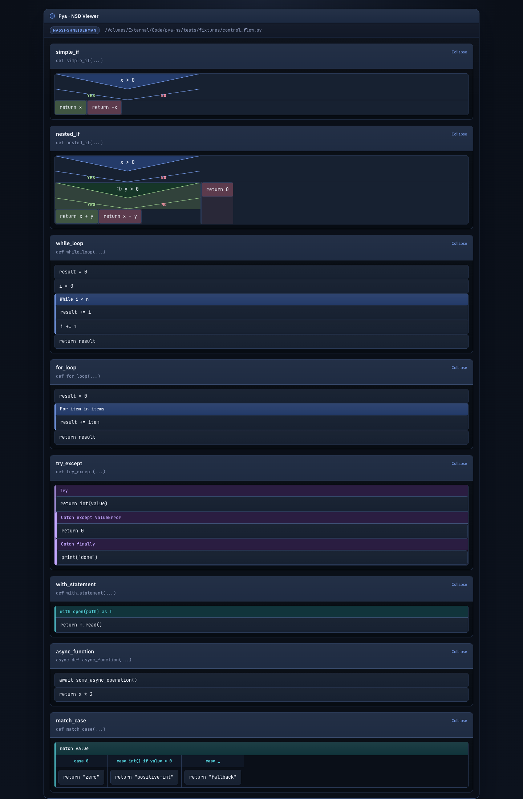
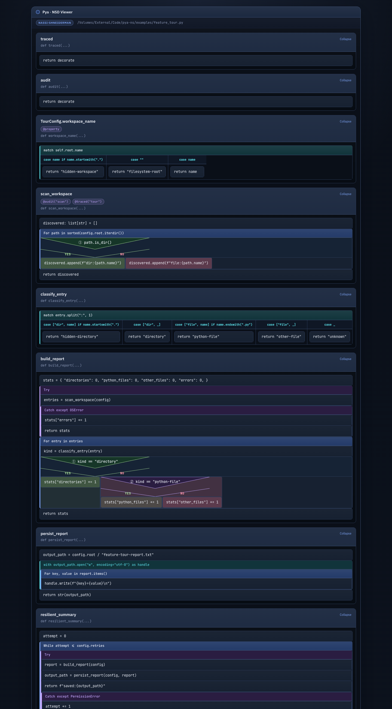

# Pya

Pya is a simple, scalable monolith for parsing Python source code through ANTLR while keeping the architecture clean enough for future semantic analysis, indexing, and export pipelines.

The project starts from the domain, not from the framework:

* business goal: convert Python source into a stable structural model for downstream tooling
* architectural style: DDD-inspired layered monolith with hexagonal boundaries
* parser engine: ANTLR4 with the public Python3 grammar from `antlr/grammars-v4`, with Java→Python compatibility patches
* current delivery channel: CLI that parses a file or a directory and returns versioned JSON

## Feature Matrix

| Feature | Priority | Status |
|---------|----------|--------|
| Parse one Python file | p0 | done |
| Parse a directory of Python files | p0 | done |
| Structural model: imports, functions, classes, variables | p0 | done |
| Syntax diagnostics as part of the parse contract | p0 | done |
| Versioned JSON output | p0 | done |
| Async function extraction (`async def`) | p0 | done |
| Control flow extraction (if/elif/else, while, for, try/except, with) | p1 | done |
| Nassi-Shneiderman HTML diagrams per file | p1 | done |
| Nassi-Shneiderman HTML diagram bundles for directories | p1 | done |
| Depth-coded nested conditionals (up to 50 levels) | p1 | done |
| Dark Tokyo Night theme with JetBrains Mono | p1 | done |
| match/case control flow (Python 3.10+) | p1 | done |
| Decorator extraction | p1 | done |
| Symbol graph / cross-reference export | p3 | done |
| Semantic passes (type inference, call graph) | p3 | done |
| Incremental parsing and caching | p3 | done |
| Interactive HTML diagrams with collapsible nodes | p3 | done |
| Export to other diagram formats (SVG, PNG, Mermaid) | p3 | done |
| Integration adapters for external analysis tools | p3 | done |

## What the system does

Today the system supports:

* **Parsing Python code**
  * parsing one Python file
  * parsing a directory of Python files
  * extracting a lightweight structural model: imports, function definitions (sync and async), class definitions, and module-level variables
  * reporting syntax diagnostics as part of the contract

* **Control flow extraction**
  * if/elif/else statements with nested branches
  * while loops
  * for loops
  * try/except/finally blocks
  * with statements
  * match/case statements, including guarded cases

* **Nassi-Shneiderman diagrams**
  * building a Nassi-Shneiderman HTML diagram for one Python file
  * building diagram bundles for entire directories with index page
  * classic NS rendering with SVG triangles for if-blocks
  * depth-coded nested ifs (up to 50 levels with color cycling and Unicode badges ①-㊿)
  * dark Tokyo Night-inspired theme with JetBrains Mono font
  * proper text wrapping and responsive layout
  * collapsible function panels for interactive browsing
  * export to Mermaid and SVG, plus PNG when a system rasterizer is available

* **Semantic and graph exports**
  * decorator extraction in the structural model
  * symbol graph and cross-reference export
  * lightweight semantic passes for inferred local types, inferred returns, and outbound call graph
  * adapters for JSON, Cytoscape, and Graphviz DOT consumers
  * content-addressed parse caching for repeated runs

* **Architecture**
  * keeping parser infrastructure behind ports so the application layer stays independent from ANTLR, filesystem, and CLI details

## Diagram Features

The Nassi-Shneiderman diagrams include:

* **Visual clarity**
  * Classic NS triangles for if-blocks with Yes/No labels
  * Color-coded block types (loops=blue, try/except=orange, with=teal, etc.)
  * JetBrains Mono monospace font for code readability

* **Depth awareness**
  * 50 depth levels with cycling colors (blue → green → purple → teal → amber)
  * Unicode circled badges (①-⑩, ⑪-⑳, ㉑-㉟, ㊱-㊿) on nested conditionals
  * Background tinting for deeper nesting levels

* **Dark theme**
  * Tokyo Night-inspired color palette optimized for code readability
  * Proper contrast ratios for comfortable viewing
  - Responsive layout for different screen sizes

* **Smart parsing**
  * Fast path for simple function bodies
  * Fallback to full-file parse when lightweight scanner cannot isolate function bodies
  * Handles Python's significant whitespace via the ANTLR grammar's built-in NEWLINE/INDENT/DEDENT tokens

### Screenshots

**Basic control flow** — loops and try/except blocks:



**Nested conditionals** — depth-coded badges and colors for up to 50 nesting levels:



## Architecture

The codebase is split into four explicit layers:

* `domain`: domain model, invariants, ports, and domain events
* `application`: use cases and DTOs
* `infrastructure`: ANTLR adapter, filesystem adapters, event publishing
* `presentation`: CLI contract

See the full design docs in [docs/domain-and-goals.md](docs/domain-and-goals.md), [docs/requirements.md](docs/requirements.md), [docs/system-context.md](docs/system-context.md), [docs/glossary.md](docs/glossary.md), and [docs/architecture.md](docs/architecture.md).

## Quick Start

1. Install dependencies:

```bash
uv sync --extra dev
```

2. The Python3 grammar files are already vendored in `resources/grammars/python3/` and the parser is pre-generated. To regenerate:

```bash
uv run python scripts/generate_python_parser.py
```

3. Parse a single file:

```bash
uv run pya parse-file path/to/module.py
```

4. Parse a directory:

```bash
uv run pya parse-dir path/to/project
```

5. Build a Nassi-Shneiderman diagram for a Python file:

```bash
uv run pya nassi-file path/to/algorithms.py --out output/algorithms.nassi.html
```

Export Mermaid or SVG instead:

```bash
uv run pya nassi-file path/to/algorithms.py --format mermaid
uv run pya nassi-file path/to/algorithms.py --format svg
```

6. Build Nassi-Shneiderman diagrams for an entire directory:

```bash
uv run pya nassi-dir path/to/project --out output/nassi-bundle
```

7. Export semantic analysis, symbol graph, and cross-references:

```bash
uv run pya analyze-file path/to/module.py
uv run pya analyze-dir path/to/project --adapter cytoscape
uv run pya analyze-file path/to/module.py --adapter graphviz-dot
```

## Constraints and honesty

The grammar is sourced from `antlr/grammars-v4/python/python3`. It targets the Python 3 grammar and is maintained by the antlr/grammars-v4 community. The upstream grammar includes embedded actions with Java-specific syntax (e.g., `this.` references) that require compatibility patches for Python target generation. Pya applies these patches automatically during parser generation via `scripts/generate_python_parser.py`. Pya makes grammar limitations explicit in requirements, ADRs, and runtime metadata so downstream consumers know what contract they are integrating with.

## Next Steps

Useful future extensions:

* richer symbol resolution across files and packages
* stronger type inference beyond annotations and literal heuristics
* persistent index storage for large repositories
* richer SVG/PNG layout parity with the HTML renderer
